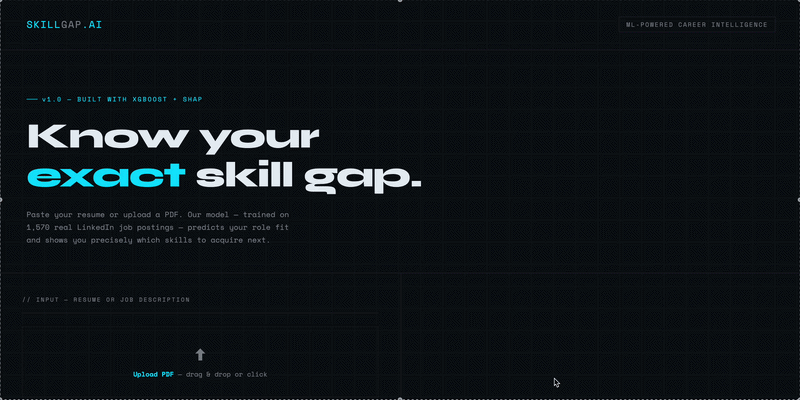
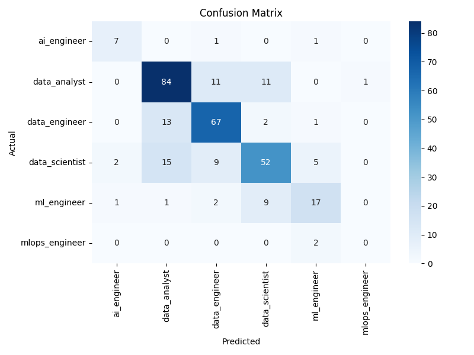
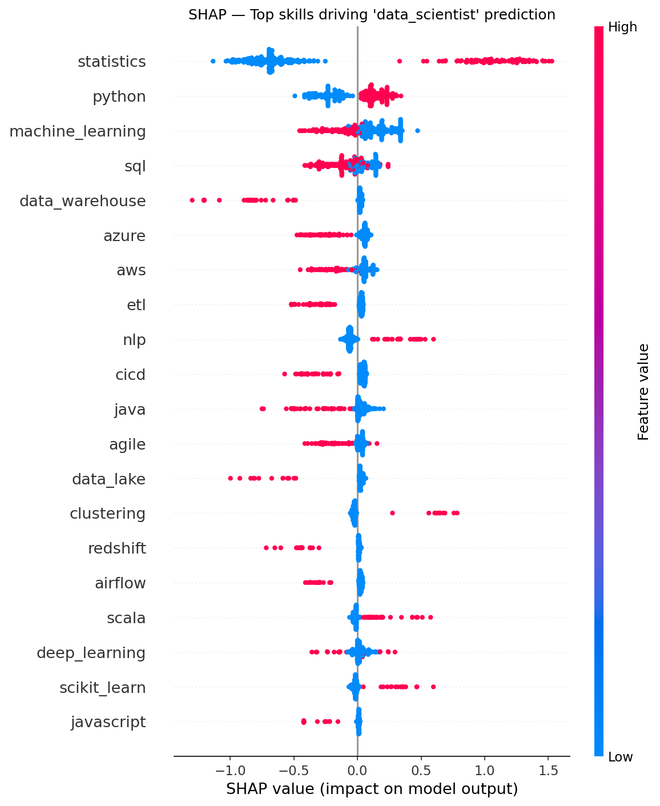

# SkillGap.AI — ML-Powered Career Intelligence

> Know your exact skill gap. Trained on 1,570 real LinkedIn job postings.



---

## Overview

**SkillGap.AI** is an end-to-end machine learning application that analyzes your resume or job description and tells you:

- **Which data role you're best suited for** — Data Scientist, ML Engineer, Data Engineer, Data Analyst, AI Engineer, or MLOps Engineer
- **Your confidence score** across all six roles
- **Exactly which skills you're missing** for your target role
- **A prioritized learning path** with curated resources for each gap

Built entirely from scratch — data collection, feature engineering, model training, explainability, and a custom web interface. No templates, no shortcuts.

---

## Demo


Paste your resume → select target role → get instant analysis.

---

## How It Works

```
Resume / JD Text
       │
       ▼
 Skill Extraction          ← spaCy PhraseMatcher, 68 skills
       │
       ▼
 Feature Vector            ← binary skill presence matrix
       │
       ▼
 XGBoost Classifier        ← trained on 1,570 LinkedIn postings
       │
       ▼
 Role Prediction           ← 6 classes, 73% accuracy
       │
       ▼
 SHAP Explainability       ← why this prediction
       │
       ▼
 Skill Gap Report          ← what to learn next + resources
```

---

## Tech Stack

| Layer | Technology |
|---|---|
| **ML Model** | XGBoost (multiclass classification) |
| **Explainability** | SHAP TreeExplainer |
| **NLP / Skill Extraction** | spaCy PhraseMatcher |
| **Experiment Tracking** | MLflow |
| **Backend** | Flask |
| **Frontend** | Custom HTML/CSS (no frameworks) |
| **PDF Parsing** | pdfminer.six |
| **Data** | LinkedIn Job Postings (Kaggle, 123k rows) |

---

## Project Structure

```
skill-gap-analyzer/
│
├── data/
│   ├── raw/                    # LinkedIn job postings (Kaggle)
│   └── processed/
│       ├── ml_job_features.csv # skill feature matrix (1,570 × 73)
│       ├── xgb_model.json      # trained XGBoost model
│       ├── label_encoder.pkl   # role label encoder
│       ├── confusion_matrix.png
│       └── shap_summary.png
│
├── src/
│   ├── filter_jobs.py          # filter 123k → 1,570 ML/Data jobs
│   ├── skill_extractor.py      # build binary skill feature matrix
│   ├── train.py                # train XGBoost + SHAP + MLflow
│   ├── pdf_parser.py           # PDF text extraction
│   └── flask_app.py            # Flask web application
│
├── templates/
│   └── index.html              # custom dark terminal UI
│
├── notebook/
│   └── EDA.ipynb               # exploratory data analysis
│
├── requirements.txt
├── Procfile
├── render.yaml
└── README.md
```

---

## Model Performance

```
              precision    recall  f1-score   support

 ai_engineer       0.70      0.78      0.74         9
 data_analyst      0.74      0.79      0.76       107
data_engineer      0.74      0.81      0.77        83
data_scientist     0.70      0.63      0.66        83
  ml_engineer      0.65      0.57      0.61        30

    accuracy                           0.73       314
```

Training data: 1,256 samples | Test data: 314 samples | Features: 68 binary skill flags

**Confusion Matrix**



**SHAP Feature Importance** — top skills driving Data Scientist predictions



---

## Skill Coverage

68 skills tracked across 8 categories:

| Category | Skills |
|---|---|
| **Languages** | Python, SQL, R, Scala, Java, JavaScript, C++ |
| **ML Frameworks** | PyTorch, TensorFlow, Scikit-learn, XGBoost, LightGBM, HuggingFace |
| **ML Concepts** | Deep Learning, NLP, Computer Vision, LLMs, RAG, Feature Engineering |
| **Data Engineering** | Spark, Kafka, Airflow, dbt, ETL, Data Pipelines |
| **Databases** | PostgreSQL, MongoDB, Snowflake, BigQuery, Redshift |
| **Cloud** | AWS, GCP, Azure |
| **MLOps** | Docker, Kubernetes, MLflow, CI/CD, Terraform, Databricks |
| **Visualization** | Tableau, Power BI, Plotly, Matplotlib |

---

## Getting Started

### Prerequisites

- Python 3.10+
- pip

### Installation

```bash
# Clone the repo
git clone https://github.com/YOUR_USERNAME/skill-gap-analyzer.git
cd skill-gap-analyzer

# Create virtual environment
python -m venv .venv
source .venv/bin/activate  # Mac/Linux
# .venv\Scripts\activate   # Windows

# Install dependencies
pip install -r requirements.txt
python -m spacy download en_core_web_sm
```

### Run Locally

```bash
python src/flask_app.py
```

Open `http://localhost:5000`

### Retrain the Model (optional)

If you want to retrain from scratch using the Kaggle dataset:

```bash
# 1. Download LinkedIn Job Postings from Kaggle
# https://www.kaggle.com/datasets/arshkon/linkedin-job-postings
# Place job_postings.csv in data/raw/

# 2. Filter to ML/Data roles
python src/filter_jobs.py

# 3. Extract skill features
python src/skill_extractor.py

# 4. Train model
python src/train.py

# 5. View MLflow experiments
mlflow ui
```

---

## Data Pipeline

**Raw → Filtered → Features → Model**

```
123,849 LinkedIn job postings
         │
         ▼  filter by title keywords
    1,570 ML/Data jobs
         │
         ▼  spaCy PhraseMatcher (68 skills)
    1,570 × 73 feature matrix
         │
         ▼  XGBoost multiclass
    trained model (73% accuracy)
```

Role distribution in training data:

| Role | Count |
|---|---|
| Data Analyst | 536 |
| Data Scientist | 416 |
| Data Engineer | 414 |
| ML Engineer | 148 |
| AI Engineer | 47 |
| MLOps Engineer | 9 |

---

## Key Design Decisions

**Why XGBoost over a neural network?**
The feature space is 68 binary flags — tabular, sparse, and interpretable. XGBoost is the right tool. A neural network would overfit on this data size with no meaningful accuracy gain.

**Why spaCy PhraseMatcher over TF-IDF?**
We need deterministic, interpretable skill extraction. TF-IDF would surface "the", "and", "experience" as features. PhraseMatcher gives us clean, named skill flags that map directly to real skills.

**Why binary features instead of TF-IDF weights?**
Skill presence is binary in practice — you either know PyTorch or you don't. Frequency of mention in a JD doesn't meaningfully change the signal.

**Why SHAP?**
SHAP provides per-prediction explanations, not just global feature importance. This powers the "which skill matters most for your gap" feature — the core product value.

---

## What's Next

- [ ] Resume scoring against a specific job description (not just role category)
- [ ] Sentence embeddings to replace binary skill vectors (bridge to DL)
- [ ] Job posting scraper to analyze live market demand
- [ ] Skill trend analysis over time

---

## Author

**Kishore Kumar**
First-year AI & Data Science student at Kumaraguru College of Technology (KCT)
Mahatma Gandhi Merit Scholarship Recipient

Building toward Applied AI Engineering with RAG systems and agentic AI as core specialization.

[]([https://linkedin.com/in/YOUR_LINKEDIN](https://www.linkedin.com/in/kishore-kumar-77a280387/))
[]([https://github.com/YOUR_USERNAME](https://github.com/KishoreKumar477))

---

## License

MIT License — free to use, modify, and distribute with attribution.

---

<p align="center">
  Built with Python · XGBoost · spaCy · Flask · SHAP · MLflow
</p>
